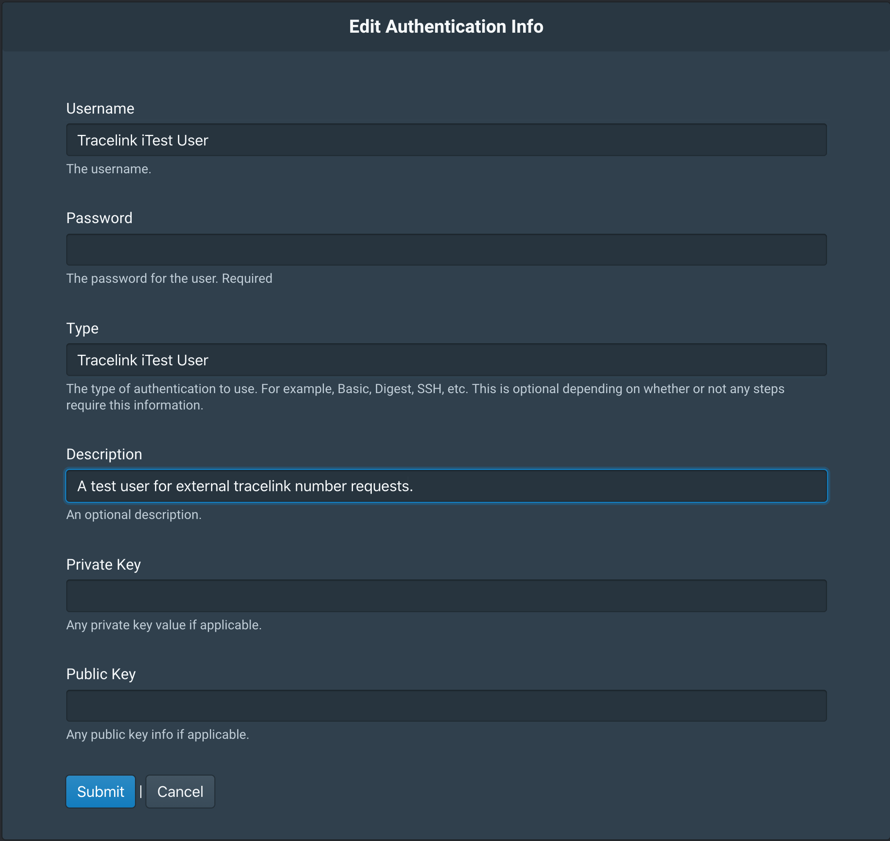

Importing Tracelink External Number Ranges
++++++++++++++++++++++++++++++++++++++++++

To make life easier, you can import trade item information into QU4RTET using
a step available in the tracelink module.  To import data you will need a csv
file with the following columns:

    Item - an internal material number (or GTIN)
    Uom - the UOM fo the item level trade items- for example EA
    GTIN - the GTIN14 for the saleable / base trade item
    Level2 UOM - the UOM for the second level of aggregation - for example Bdl or Cs
    Level2 GTIN - the GTIN 14 for the level 2 packaging layer
    Quantity of L1 in L2 - the number of items that are packed into the second level
    Level3 UOM - UOM for level 3
    Level3 GTIN - the GTIN 14 for the third level (or none if there is no third level)
    Quantity of L2 in L3 - the pack count for level 3
    SSCC Quantity - the number of items packed into SSCC level
    Description - the trade item name
    Customer - the external customer name
    L4 - should always be Tracelink (case sensitive)
    GLN - The GLN for the external trading partner
    SGLN - The SGLN for the external trading partner (if available)
    Company Prefix - The company prefix for the external trading partner

Step 1.  Run the tracelink management command
=============================================
Your system will need to have the quartet_tracelink python package installed
and configured in your config/settings/local_settings.py for QU4RTET.

At the command line run

.. code-block:: text

    python manage.py setup_tracelink

Step 2. Create the External Authentication Info
===============================================

In order to request numbers from an external tracelink system you will need
to configure a username / password combination in QU4RTET.  To achieve this
you will configure a new *Authentication Info* record with this data.

After you create your Authentication Info record, make note of its ID value
in the Authentication Info table display in the UI.  You will need this
for your rule/step below.

Step 2. Create a new Rule
=========================

Next create a new rule with a single step.

* Rule Name:  TraceLink SNX Import
* Description:  Imports master data and creates integrated external number ranges.

Step 3.  Create a Step for the Rule
===================================

Next create a step for the rule you created above.

* Step: Import Spreadsheet Master Data
* Description: Imports master data from csv and creates external ranges.
* Class Path: quartet_integrations.tracelink.steps.ExternalTradeItemNumberRangeImportStep
* Execution Order: 1

Step 4.  Add Step Parameters
============================

* Authentication Info ID:  The ID value of the Authentication Info record you created.
* Endpoint: should always be *Tracelink SNX Request*
* Sending System GLN: This should be your system's GLN as expected by Tracelink
* Response Rule Name: This will be the response rule you are using if you need
  a custom response.  A typical response rule will have a list conversion step and
  a Format Message step.  This varies from integration to integration depending
  on what downstream systems expect to see.  If you are using standard SerialBox
  responses you do not need to supply this value.
* Threshold: The max numbers that can be requested from any created number
  pools.

Step 5. Upload the CSV Data
===========================

In QU4RTET UI, right click on your new rule and upload your file.
